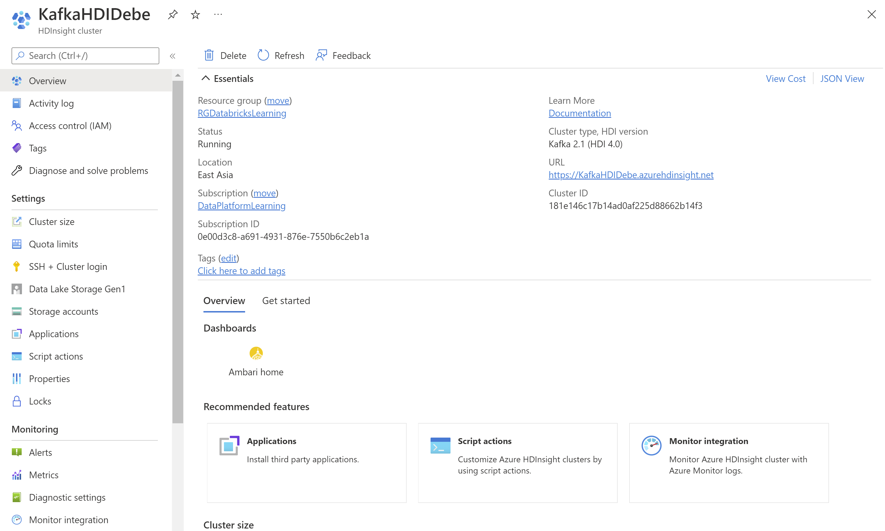

# Azure-Based MySQL CDC Open Source Solution

`debezium CDC connector for MySQL`  `strimzi kafka connect cluster` `azure hdinsight wo/ ESP`

`azure kubernetes services` `azure database for mysql`

# Objective

Debezium MySQL Connector on Strimzi Kafka Connect Cluster Integration w/ Azure HDInsight wo/ ESP


[TOC]

# Architecture


# Prepare HDInsight Kafka Cluster




> Parameter setting & Restart components:
>
> | Parameter Name             | Default Value | Set Value |
> | -------------------------- | ------------- | --------- |
> | auto.create.topics.enable  | false         | true      |
> | default.replication.factor | 4             | 3         |
> | num.replica.fetchers       | 4             | 3         |


# Install tools

 `kubectl` `azure cli` `docker engine`

## kubectl
```bash
mkdir tools
cd tools
curl -LO "https://dl.k8s.io/release/$(curl -L -s https://dl.k8s.io/release/stable.txt)/bin/linux/amd64/kubectl"
chmod +x kubectl

vi .bashrc
TOOLS_HOME=/root/tools
export PATH=$PATH:$TOOLS_HOME

source .bashrc
```

## azure cli
```bash
curl -sL https://aka.ms/InstallAzureCLIDeb | sudo bash
```

## docker engine
```bash
apt-get remove docker docker-engine docker.io containerd runc
apt-get update
apt-get install ca-certificates curl gnupg lsb-release

curl -fsSL https://download.docker.com/linux/ubuntu/gpg | sudo gpg --dearmor -o /usr/share/keyrings/docker-archive-keyring.gpg

echo "deb [arch=$(dpkg --print-architecture) signed-by=/usr/share/keyrings/docker-archive-keyring.gpg] https://download.docker.com/linux/ubuntu $(lsb_release -cs) stable" | sudo tee /etc/apt/sources.list.d/docker.list > /dev/null

apt-get update
apt-get install docker-ce docker-ce-cli containerd.io
docker run hello-world
```

# List all deployments in all namespaces

``` bash
az cloud list --output table
az cloud set --name AzureCloud
az account set --subscription 0e00d3c8-a691-4931-876e-7550b6c2eb1a
az aks get-credentials --resource-group RGKubernetes --name aks-for-data-services

kubectl get deployments --all-namespaces=true
```

# Deploy strizmi kafka and debezium connector

## Download packages
```bash
mkdir strimzi-debezium
cd strimzi-debezium

wget https://github.com/strimzi/strimzi-kafka-operator/releases/download/0.28.0/strimzi-0.28.0.tar.gz

wget https://repo1.maven.org/maven2/io/debezium/debezium-connector-mysql/1.9.1.Final/debezium-connector-mysql-1.9.1.Final-plugin.tar.gz

tar xvfz strimzi-0.28.0.tar.gz
tar xvfz debezium-connector-mysql-1.9.1.Final-plugin.tar.gz
```

## Deploy strizmi kafka
### Deploy strizmi kafka operator
```shell
cd /root/strimzi-debezium/strimzi-0.28.0
sed -i 's/namespace: .*/namespace: ns4debezium/' install/cluster-operator/*RoleBinding*.yaml

kubectl create namespace ns4debezium
kubectl create -f /root/strimzi-debezium/strimzi-0.28.0/install/cluster-operator -n ns4debezium
kubectl get deployments -n ns4debezium
```

## Deploy debezium connector
### Build debezium connector w/ strimzi kafka connect image
```shell
cd /root/strimzi-debezium

cat <<EOF > Dockerfile
FROM quay.io/strimzi/kafka:0.28.0-kafka-3.1.0
USER root:root
RUN mkdir -p /opt/kafka/plugins/debezium
COPY ./debezium-connector-mysql/ /opt/kafka/plugins/debezium/
USER 1001
EOF

docker login acr4dataimages.azurecr.io
acr4dataimages
0D=7Xf3g8HCBLEcmY=Bqh7euSP5hcaHs

docker build . -t acr4dataimages.azurecr.io/connect-debezium
docker push acr4dataimages.azurecr.io/connect-debezium
```

### Configure MySQL credentials to kubernetes
```shell
# Get base64 string
echo -n 'insadmin' | base64
echo -n '8F5F5071@5361@474a@8cc7@4E8299DFFBFE' | base64
```

```bash
cat << EOF > mysql-credentials.yaml
apiVersion: v1
kind: Secret
metadata:
  name: debezium-secret
  namespace: ns4debezium
type: Opaque
data:
  mysqluid: aW5zYWRtaW4=
  mysqlpwd: OEY1RjUwNzFANTM2MUA0NzRhQDhjYzdANEU4Mjk5REZGQkZF
EOF

kubectl apply -f mysql-credentials.yaml -n ns4debezium
```

```bash
cat << EOF > debezium-role.yaml
apiVersion: rbac.authorization.k8s.io/v1
kind: Role
metadata:
  name: connector-configuration-role
  namespace: ns4debezium
rules:
- apiGroups: [""]
  resources: ["secrets"]
  resourceNames: ["debezium-secret"]
  verbs: ["get"]
EOF

kubectl apply -f debezium-role.yaml -n ns4debezium
```

```bash
cat << EOF > debezium-role-binding.yaml
apiVersion: rbac.authorization.k8s.io/v1
kind: RoleBinding
metadata:
  name: connector-configuration-role-binding
  namespace: ns4debezium
subjects:
- kind: ServiceAccount
  name: mysql-connect-cluster-connect
  namespace: ns4debezium
roleRef:
  kind: Role
  name: connector-configuration-role
  apiGroup: rbac.authorization.k8s.io
EOF

kubectl apply -f debezium-role-binding.yaml -n ns4debezium
```

### Deploy debezium mysql kafka connect cluster
```bash
cat << EOF > debezium-mysql-connect.yaml
apiVersion: kafka.strimzi.io/v1beta2
kind: KafkaConnect
metadata:
  name: mysql-connect-cluster
  annotations:
    strimzi.io/use-connector-resources: "true"
spec:
  version: 3.1.0
  image: acr4dataimages.azurecr.io/connect-debezium:latest
  replicas: 1
  bootstrapServers: "192.168.2.75:9092,192.168.2.73:9092,192.168.2.74:9092"
  config:
    config.providers: secrets
    config.providers.secrets.class: io.strimzi.kafka.KubernetesSecretConfigProvider
    group.id: connect-cluster-group
    offset.storage.topic: connect-cluster-offsets
    config.storage.topic: connect-cluster-configs
    status.storage.topic: connect-cluster-status
    auto.create.topics.enable: true
    offset.flush.interval.ms: 10000
    rest.advertised.host.name: connect
    key.converter: org.apache.kafka.connect.json.JsonConverter
    value.converter: org.apache.kafka.connect.json.JsonConverter
    key.converter.schemas.enable: false
    value.converter.schemas.enable: false
    internal.key.converter.schemas.enable: false
    internal.value.converter.schemas.enable: false
    internal.key.converter: org.apache.kafka.connect.json.JsonConverter
    internal.value.converter: org.apache.kafka.connect.json.JsonConverter
    config.storage.replication.factor: 3
    offset.storage.replication.factor: 3
    status.storage.replication.factor: 3
    producer.connections.max.idle.ms: 180000
    producer.metadata.max.age.ms: 180000
EOF

kubectl apply -f debezium-mysql-connect.yaml -n ns4debezium
```

### Deploy debezium mysql kafka connector configure
```bash
cat << EOF > classicmodels-connector.yaml
apiVersion: kafka.strimzi.io/v1beta2
kind: KafkaConnector
metadata:
  name: classicmodels-connector
  labels:
    strimzi.io/cluster: mysql-connect-cluster
spec:
  class: io.debezium.connector.mysql.MySqlConnector
  tasksMax: 1
  config:
    tasks.max: 1
    connector.class: io.debezium.connector.mysql.MySqlConnector
    database.hostname: fsmy4debezium.mysql.database.azure.com
    database.port: 3306
    database.user: ${secrets:ns4debezium/debezium-secret:mysqluid}
    database.password: ${secrets:ns4debezium/debezium-secret:mysqlpwd}
    database.server.id: 184080
    database.server.name: fsmy4debezium.mysql.database.azure.com
    database.include.list: classicmodels
    database.history.kafka.bootstrap.servers: "192.168.2.75:9092,192.168.2.73:9092,192.168.2.74:9092"
    database.history.kafka.topic: schema-changes.classicmodels
    include.schema.changes: true
EOF

kubectl apply -f classicmodels-connector.yaml -n ns4debezium
```

### Check CDC Topic Status

#### Check Topic List

```bash
/usr/hdp/current/kafka-broker/bin/kafka-topics.sh --list --zookeeper 192.168.2.71:2181,192.168.2.69:2181,192.168.2.70:2181

--- Result ---
__consumer_offsets
connect-cluster-configs
connect-cluster-offsets
connect-cluster-status
fsmy4debezium.mysql.database.azure.com
fsmy4debezium.mysql.database.azure.com.classicmodels.customers
fsmy4debezium.mysql.database.azure.com.classicmodels.demo
fsmy4debezium.mysql.database.azure.com.classicmodels.employees
fsmy4debezium.mysql.database.azure.com.classicmodels.offices
fsmy4debezium.mysql.database.azure.com.classicmodels.orderdetails
fsmy4debezium.mysql.database.azure.com.classicmodels.orders
fsmy4debezium.mysql.database.azure.com.classicmodels.payments
fsmy4debezium.mysql.database.azure.com.classicmodels.productlines
fsmy4debezium.mysql.database.azure.com.classicmodels.products
fsmy4debezium.mysql.database.azure.com.classicmodels.todos
schema-changes.classicmodels
```

#### Check Topic Status

```bash
/usr/hdp/current/kafka-broker/bin/kafka-topics.sh --zookeeper 192.168.2.71:2181,192.168.2.69:2181,192.168.2.70:2181 --describe --topic fsmy4debezium.mysql.database.azure.com.classicmodels.employees

--- Result ---
Topic:fsmy4debezium.mysql.database.azure.com.classicmodels.employees    PartitionCount:1        ReplicationFactor:3     Configs:
        Topic: fsmy4debezium.mysql.database.azure.com.classicmodels.employees   Partition: 0    Leader: 1002    Replicas: 1002,1001,1003        Isr: 1002,1001,1003
```

#### Check Topic Content

```bash
/usr/hdp/current/kafka-broker/bin/kafka-console-consumer.sh --bootstrap-server 192.168.2.75:9092,192.168.2.73:9092,192.168.2.74:9092 --topic fsmy4debezium.mysql.database.azure.com.classicmodels.employees --from-beginning

--- Result ---
{"before":null,"after":{"employeeNumber":1002,"lastName":"Murphy","firstName":"Diane","extension":"x5800","email":"dmurphy@classicmodelcars.com","officeCode":"1","reportsTo":null,"jobTitle":"President"},"source":{"version":"1.9.1.Final","connector":"mysql","name":"fsmy4debezium.mysql.database.azure.com","ts_ms":1657277322264,"snapshot":"true","db":"classicmodels","sequence":null,"table":"employees","server_id":0,"gtid":null,"file":"mysql-bin.000011","pos":1766,"row":0,"thread":null,"query":null},"op":"r","ts_ms":1657277322264,"transaction":null}
{"before":null,"after":{"employeeNumber":1056,"lastName":"Patterson","firstName":"Mary","extension":"x4611","email":"mpatterso@classicmodelcars.com","officeCode":"1","reportsTo":1002,"jobTitle":"VP Sales"},"source":{"version":"1.9.1.Final","connector":"mysql","name":"fsmy4debezium.mysql.database.azure.com","ts_ms":1657277322264,"snapshot":"true","db":"classicmodels","sequence":null,"table":"employees","server_id":0,"gtid":null,"file":"mysql-bin.000011","pos":1766,"row":0,"thread":null,"query":null},"op":"r","ts_ms":1657277322264,"transaction":null}
...
	skip some result contents
...
{"before":null,"after":{"employeeNumber":1702,"lastName":"Gerard","firstName":"Martin","extension":"x2312","email":"mgerard@classicmodelcars.com","officeCode":"4","reportsTo":1102,"jobTitle":"Sales Rep"},"source":{"version":"1.9.1.Final","connector":"mysql","name":"fsmy4debezium.mysql.database.azure.com","ts_ms":1657277322269,"snapshot":"true","db":"classicmodels","sequence":null,"table":"employees","server_id":0,"gtid":null,"file":"mysql-bin.000011","pos":1766,"row":0,"thread":null,"query":null},"op":"r","ts_ms":1657277322269,"transaction":null}
^CProcessed a total of 23 messages
```


# Reference documents

> [Quickstart: Set up Apache Kafka on HDInsight using Azure portal | Microsoft Docs](https://docs.microsoft.com/en-us/azure/hdinsight/kafka/apache-kafka-get-started)
