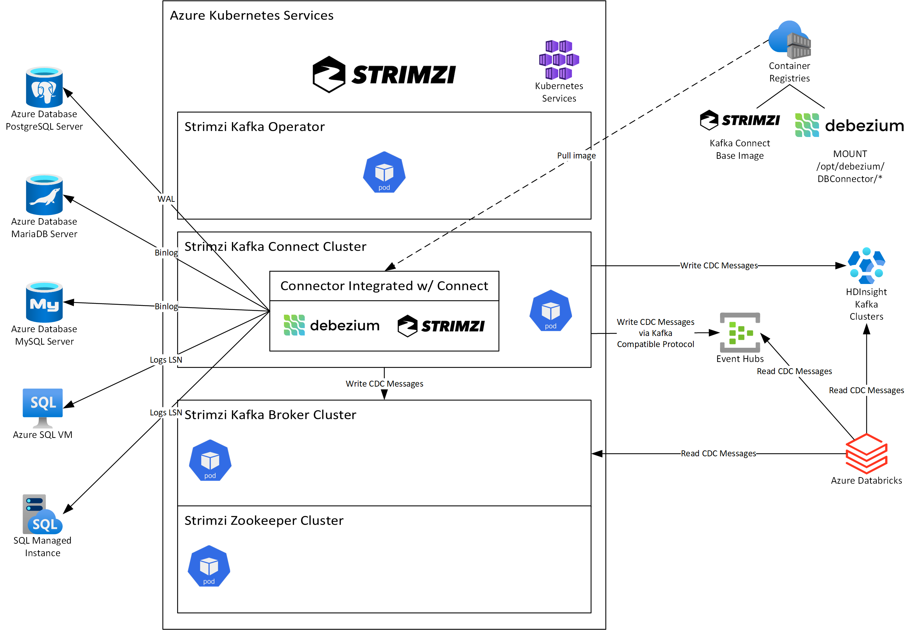
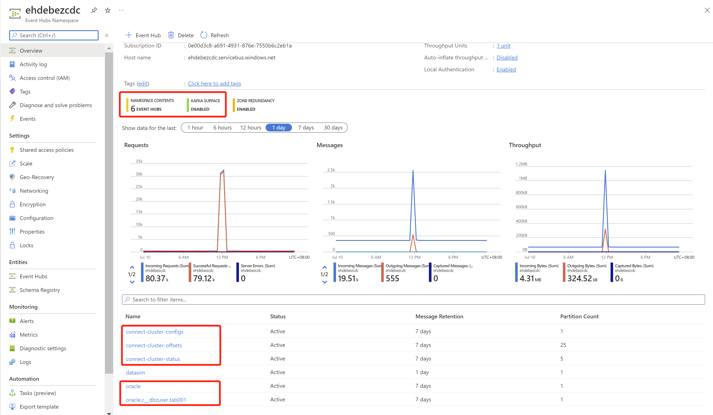
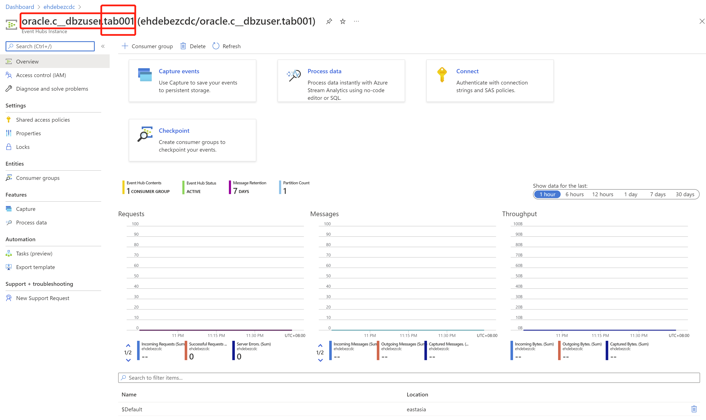
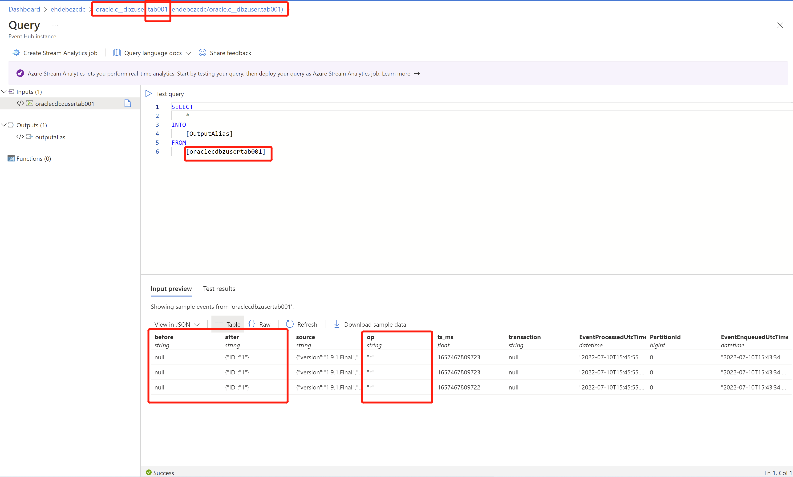
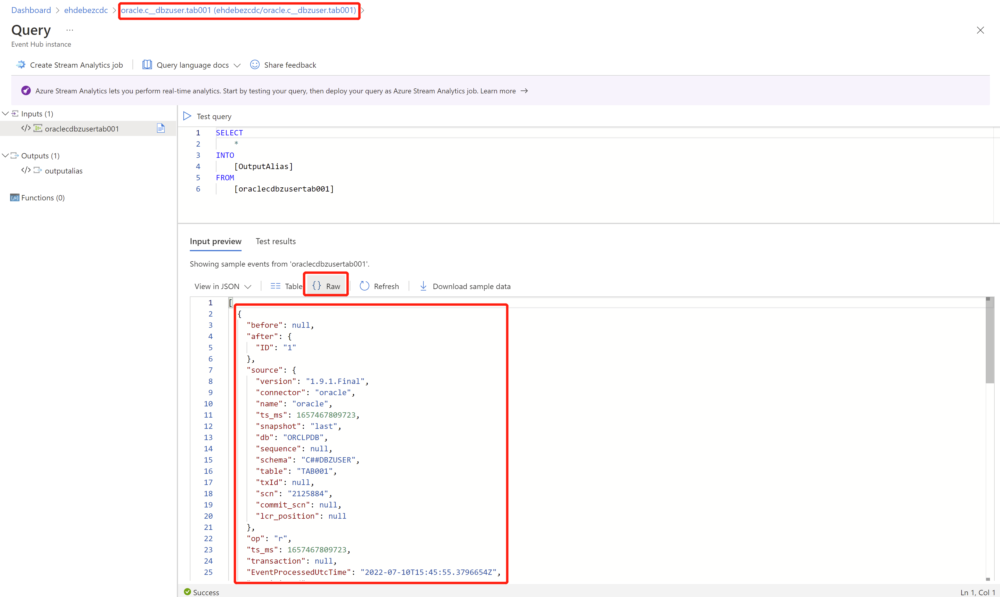

# Azure-Based Oracle CDC Open Source Solution

`debezium CDC connector for oracle`  `strimzi kafka connect cluster` `azure eventhub`

`azure kubernetes services` `oracle 19c CDB/PDB` `oracle logminer`

# Objective

Debezium Oracle Connector on Strimzi Kafka Connect Cluster Integration w/ Azure Event Hub

> Suggest: CDC Production Environment require Azure Event Hub at least the Premium pricing tier

[TOC]

# Architecture



# Prepare oracle for debezium

## Oracle listener services ready

```bash
lsnrctl services
--- result ---
LSNRCTL for 64-bit Windows: Version 19.0.0.0.0 - Production on 10-JUL-2022 20:13:58

Copyright (c) 1991, 2019, Oracle.  All rights reserved.

Connecting to (DESCRIPTION=(ADDRESS=(PROTOCOL=TCP)(HOST=WINORC19.bjiovdbxfvkejfvdeeiz4oopug.hx.internal.cloudapp.net)(PORT=1521)))
Services Summary...
Service "52448234712340b69f274bcc790ecfe0" has 1 instance(s).
  Instance "orclcdb", status READY, has 1 handler(s) for this service...
    Handler(s):
      "DEDICATED" established:0 refused:0 state:ready
         LOCAL SERVER
Service "CLRExtProc" has 1 instance(s).
  Instance "CLRExtProc", status UNKNOWN, has 1 handler(s) for this service...
    Handler(s):
      "DEDICATED" established:0 refused:0
         LOCAL SERVER
Service "c1d3fc8ac0bc4f91a4f42974b517303e" has 1 instance(s).
  Instance "orclcdb", status READY, has 1 handler(s) for this service...
    Handler(s):
      "DEDICATED" established:0 refused:0 state:ready
         LOCAL SERVER
Service "orclcdb" has 1 instance(s).
  Instance "orclcdb", status READY, has 1 handler(s) for this service...
    Handler(s):
      "DEDICATED" established:0 refused:0 state:ready
         LOCAL SERVER
Service "orclcdbXDB" has 1 instance(s).
  Instance "orclcdb", status READY, has 1 handler(s) for this service...
    Handler(s):
      "D000" established:0 refused:0 current:0 max:1022 state:ready
         DISPATCHER <machine: WINORC19, pid: 5512>
         (ADDRESS=(PROTOCOL=tcp)(HOST=WINORC19)(PORT=50429))
Service "orclpdb" has 1 instance(s).
  Instance "orclcdb", status READY, has 1 handler(s) for this service...
    Handler(s):
      "DEDICATED" established:0 refused:0 state:ready
         LOCAL SERVER
The command completed successfully
```

## Configure TNSNames

```bash
run netca
--- result ---
Oracle Net Services Configuration:
Default local naming configuration complete.
    Created net service name: orclcdb
Default local naming configuration complete.
    Created net service name: orclpdb
Oracle Net Services configuration successful. The exit code is 0
--- end ---

or add contents to file tnsnames.ora
--- Add ---
ORCLCDB =
  (DESCRIPTION =
    (ADDRESS_LIST =
      (ADDRESS = (PROTOCOL = TCP)(HOST = 192.168.1.70)(PORT = 1521))
    )
    (CONNECT_DATA =
      (SERVICE_NAME = orclcdb)
    )
  )

ORCLPDB =
  (DESCRIPTION =
    (ADDRESS_LIST =
      (ADDRESS = (PROTOCOL = TCP)(HOST = 192.168.1.70)(PORT = 1521))
    )
    (CONNECT_DATA =
      (SERVICE_NAME = orclpdb)
    )
  )
--- end ---
```

## Oracle Archive and LogMiner Configure

```plsql
sqlplus sys/oracle as sysdba
alter system set db_recovery_file_dest_size = 10G;
alter system set db_recovery_file_dest = 'C:\oracle\app\fast_recovery_area' scope=spfile;
shutdown immediate
startup mount
alter database archivelog;
alter database open;
archive log list
--- result ---
Database log mode              Archive Mode
Automatic archival             Enabled
Archive destination            USE_DB_RECOVERY_FILE_DEST
Oldest online log sequence     1
Next log sequence to archive   2
Current log sequence           2
--- end ---
ALTER DATABASE ADD SUPPLEMENTAL LOG DATA;
exit

sqlplus sys/oracle@//192.168.1.70:1521/orclcdb as sysdba
CREATE TABLESPACE logminer_tbs DATAFILE 'C:\oracle\app\oradata\ORCLCDB\logminer_tbs.dbf' SIZE 25M REUSE AUTOEXTEND ON MAXSIZE UNLIMITED;
exit;

mkdir C:\oracle\app\oradata\ORCLCDB\ORCLPDB
sqlplus sys/oracle@//192.168.1.70:1521/orclpdb as sysdba
ALTER DATABASE OPEN;
CREATE TABLESPACE logminer_tbs DATAFILE 'C:\oracle\app\oradata\ORCLCDB\ORCLPDB\logminer_tbs.dbf' SIZE 25M REUSE AUTOEXTEND ON MAXSIZE UNLIMITED;
exit;

sqlplus sys/oracle@//192.168.1.70:1521/orclcdb as sysdba
CREATE USER c##dbzuser IDENTIFIED BY dbz DEFAULT TABLESPACE logminer_tbs QUOTA UNLIMITED ON logminer_tbs CONTAINER=ALL;
GRANT CREATE SESSION TO c##dbzuser CONTAINER=ALL;
GRANT SET CONTAINER TO c##dbzuser CONTAINER=ALL;
GRANT SELECT ON V_$DATABASE to c##dbzuser CONTAINER=ALL;
GRANT FLASHBACK ANY TABLE TO c##dbzuser CONTAINER=ALL;
GRANT SELECT ANY TABLE TO c##dbzuser CONTAINER=ALL;
GRANT SELECT_CATALOG_ROLE TO c##dbzuser CONTAINER=ALL;
GRANT EXECUTE_CATALOG_ROLE TO c##dbzuser CONTAINER=ALL;
GRANT SELECT ANY TRANSACTION TO c##dbzuser CONTAINER=ALL;
GRANT LOGMINING TO c##dbzuser CONTAINER=ALL;
GRANT CREATE TABLE TO c##dbzuser CONTAINER=ALL;
GRANT LOCK ANY TABLE TO c##dbzuser CONTAINER=ALL;
GRANT CREATE SEQUENCE TO c##dbzuser CONTAINER=ALL;
GRANT EXECUTE ON DBMS_LOGMNR TO c##dbzuser CONTAINER=ALL;
GRANT EXECUTE ON DBMS_LOGMNR_D TO c##dbzuser CONTAINER=ALL;
GRANT SELECT ON V_$LOG TO c##dbzuser CONTAINER=ALL;
GRANT SELECT ON V_$LOG_HISTORY TO c##dbzuser CONTAINER=ALL;
GRANT SELECT ON V_$LOGMNR_LOGS TO c##dbzuser CONTAINER=ALL;
GRANT SELECT ON V_$LOGMNR_CONTENTS TO c##dbzuser CONTAINER=ALL;
GRANT SELECT ON V_$LOGMNR_PARAMETERS TO c##dbzuser CONTAINER=ALL;
GRANT SELECT ON V_$LOGFILE TO c##dbzuser CONTAINER=ALL;
GRANT SELECT ON V_$ARCHIVED_LOG TO c##dbzuser CONTAINER=ALL;
GRANT SELECT ON V_$ARCHIVE_DEST_STATUS TO c##dbzuser CONTAINER=ALL;
GRANT SELECT ON V_$TRANSACTION TO c##dbzuser CONTAINER=ALL;
```

## Verify LogMiner

```pl
SELECT member FROM v$logfile;
--- result ---
C:\ORACLE\APP\FAST_RECOVERY_AREA\ORCLCDB\ONLINELOG\O1_MF_3_KDOHNXGQ_.LOG
C:\ORACLE\APP\FAST_RECOVERY_AREA\ORCLCDB\ONLINELOG\O1_MF_2_KDOHNXGQ_.LOG
C:\ORACLE\APP\FAST_RECOVERY_AREA\ORCLCDB\ONLINELOG\O1_MF_1_KDOHNX9T_.LOG
--- end ---

execute dbms_logmnr.add_logfile('C:\ORACLE\APP\FAST_RECOVERY_AREA\ORCLCDB\ONLINELOG\O1_MF_3_KDOHNXGQ_.LOG',dbms_logmnr.new);
execute dbms_logmnr.add_logfile('C:\ORACLE\APP\FAST_RECOVERY_AREA\ORCLCDB\ONLINELOG\O1_MF_2_KDOHNXGQ_.LOG',dbms_logmnr.addfile);
execute dbms_logmnr.add_logfile('C:\ORACLE\APP\FAST_RECOVERY_AREA\ORCLCDB\ONLINELOG\O1_MF_1_KDOHNX9T_.LOG',dbms_logmnr.addfile);
execute dbms_logmnr.start_logmnr(options=>dbms_logmnr.dict_from_online_catalog+dbms_logmnr.committed_data_only);
select sql_redo,sql_undo from v$logmnr_contents where table_name like '%TAB%' and OPERATION='INSERT';
execute dbms_logmnr.end_logmnr;
```

# Install tools

 `kubectl` `azure cli` `docker engine`

## kubectl
```bash
mkdir tools
cd tools
curl -LO "https://dl.k8s.io/release/$(curl -L -s https://dl.k8s.io/release/stable.txt)/bin/linux/amd64/kubectl"
chmod +x kubectl

vi .bashrc
TOOLS_HOME=/root/tools
export PATH=$PATH:$TOOLS_HOME

source .bashrc
```

## azure cli
```bash
curl -sL https://aka.ms/InstallAzureCLIDeb | sudo bash
```

## docker engine
```bash
apt-get remove docker docker-engine docker.io containerd runc
apt-get update
apt-get install ca-certificates curl gnupg lsb-release

curl -fsSL https://download.docker.com/linux/ubuntu/gpg | sudo gpg --dearmor -o /usr/share/keyrings/docker-archive-keyring.gpg

echo "deb [arch=$(dpkg --print-architecture) signed-by=/usr/share/keyrings/docker-archive-keyring.gpg] https://download.docker.com/linux/ubuntu $(lsb_release -cs) stable" | sudo tee /etc/apt/sources.list.d/docker.list > /dev/null

apt-get update
apt-get install docker-ce docker-ce-cli containerd.io
docker run hello-world
```

# Connect to Azure Kubernetes Cluster

``` bash
az cloud list --output table
az cloud set --name AzureCloud
az account set --subscription 0e00d3c8-a691-4931-876e-7550b6c2eb1a
az aks get-credentials --resource-group RGKubernetes --name aks-for-data-services

kubectl get deployments --all-namespaces=true
```

# Deploy strizmi kafka and debezium connector

## Download packages
```bash
mkdir strimzi-debezium
cd strimzi-debezium

wget https://github.com/strimzi/strimzi-kafka-operator/releases/download/0.28.0/strimzi-0.28.0.tar.gz

wget https://repo1.maven.org/maven2/io/debezium/debezium-connector-oracle/1.9.1.Final/debezium-connector-oracle-1.9.1.Final-plugin.tar.gz

wget https://repo1.maven.org/maven2/com/oracle/database/jdbc/ojdbc8/21.1.0.0/ojdbc8-21.1.0.0.jar

tar xvfz strimzi-0.28.0.tar.gz
tar xvfz debezium-connector-oracle-1.9.1.Final-plugin.tar.gz
mv ojdbc8-21.1.0.0.jar debezium-connector-oracle/
```

## Deploy strizmi kafka
### Deploy strizmi kafka operator
```shell
cd /root/strimzi-debezium/strimzi-0.28.0
sed -i 's/namespace: .*/namespace: ns4debezium/' install/cluster-operator/*RoleBinding*.yaml

kubectl create namespace ns4debezium
kubectl create -f /root/strimzi-debezium/strimzi-0.28.0/install/cluster-operator -n ns4debezium
kubectl get deployments -n ns4debezium
```

## Deploy debezium connector
### Build debezium connector w/ strimzi kafka connect image
```shell
cd /root/strimzi-debezium

cat <<EOF > Dockerfile
FROM quay.io/strimzi/kafka:0.28.0-kafka-3.1.0
USER root:root
RUN mkdir -p /opt/kafka/plugins/debezium
COPY ./debezium-connector-oracle/ /opt/kafka/plugins/debezium/
USER 1001
EOF

docker login acr4dataimages.azurecr.io
acr4dataimages
0D=7Xf3g8HCBLEcmY=Bqh7euSP5hcaHs

docker build . -t acr4dataimages.azurecr.io/connect-debezium-oracle
docker push acr4dataimages.azurecr.io/connect-debezium-oracle
```

### Configure Oracle credentials to kubernetes
```shell
# Get base64 string
echo -n 'c##dbzuser' | base64
echo -n 'dbz' | base64
```

```bash
cat << EOF > oracle-credentials.yaml
apiVersion: v1
kind: Secret
metadata:
  name: debezium-secret-oracle
  namespace: ns4debezium
type: Opaque
data:
  orcluid: YyMjZGJ6dXNlcg==
  orclpwd: ZGJ6
EOF

kubectl apply -f oracle-credentials.yaml -n ns4debezium
```

```bash
cat << EOF > eventhub-oracle-credentials.yaml
apiVersion: v1
kind: Secret
metadata:
  name: eventhub-oracle-secret
type: Opaque
stringData:
  eventhubspassword: Endpoint=sb://ehdebezcdc.servicebus.windows.net/;SharedAccessKeyName=RootManageSharedAccessKey;SharedAccessKey=3BdY8wvKw90qoubLkJKttCe/MNUt8AWgY6OkgDWm1w0=
EOF

kubectl apply -f eventhub-oracle-credentials.yaml -n ns4debezium
```

```bash
cat << EOF > debezium-oracle-role.yaml
apiVersion: rbac.authorization.k8s.io/v1
kind: Role
metadata:
  name: connector-configuration-oracle-role
  namespace: ns4debezium
rules:
- apiGroups: [""]
  resources: ["secrets"]
  resourceNames: ["debezium-secret-oracle", "eventhub-oracle-secret"]
  verbs: ["get"]
EOF

kubectl apply -f debezium-oracle-role.yaml -n ns4debezium
```

```bash
cat << EOF > debezium-oracle-role-binding.yaml
apiVersion: rbac.authorization.k8s.io/v1
kind: RoleBinding
metadata:
  name: connector-configuration-oracle-role-binding
  namespace: ns4debezium
subjects:
- kind: ServiceAccount
  name: oracle-connect-cluster-connect
  namespace: ns4debezium
roleRef:
  kind: Role
  name: connector-configuration-oracle-role
  apiGroup: rbac.authorization.k8s.io
EOF

kubectl apply -f debezium-oracle-role-binding.yaml -n ns4debezium
```

### Deploy debezium oracle kafka connect cluster
```bash
cat << EOF > debezium-oracle-connect.yaml
apiVersion: kafka.strimzi.io/v1beta2
kind: KafkaConnect
metadata:
  name: oracle-connect-cluster
  annotations:
    strimzi.io/use-connector-resources: "true"
spec:
  version: 3.1.0
  image: acr4dataimages.azurecr.io/connect-debezium-oracle:latest
  replicas: 1
  bootstrapServers: ehdebezcdc.servicebus.windows.net:9093
  config:
    config.providers: secrets
    config.providers.secrets.class: io.strimzi.kafka.KubernetesSecretConfigProvider
    offset.storage.topic: connect-cluster-offsets
    config.storage.topic: connect-cluster-configs
    status.storage.topic: connect-cluster-status
    auto.create.topics.enable: true
    offset.flush.interval.ms: 10000
    rest.advertised.host.name: connect
    key.converter: org.apache.kafka.connect.json.JsonConverter
    value.converter: org.apache.kafka.connect.json.JsonConverter
    key.converter.schemas.enable: false
    value.converter.schemas.enable: false
    internal.key.converter.schemas.enable: false
    internal.value.converter.schemas.enable: false
    internal.key.converter: org.apache.kafka.connect.json.JsonConverter
    internal.value.converter: org.apache.kafka.connect.json.JsonConverter
    config.storage.replication.factor: 1
    offset.storage.replication.factor: 1
    status.storage.replication.factor: 1
    producer.connections.max.idle.ms: 180000
    producer.metadata.max.age.ms: 180000
  authentication:
    type: plain
    username: $ConnectionString
    passwordSecret:
      secretName: eventhub-oracle-secret
      password: eventhubspassword
  tls:
    trustedCertificates: []
EOF

kubectl apply -f debezium-oracle-connect.yaml -n ns4debezium
```

### Deploy debezium oracle kafka connector configure
```bash
cat << EOF > oracle-eventhub-connector.yaml
apiVersion: kafka.strimzi.io/v1beta2
kind: KafkaConnector
metadata:
  name: oracle-connector
  labels:
    strimzi.io/cluster: oracle-connect-cluster
spec:
  class: io.debezium.connector.oracle.OracleConnector
  tasksMax: 1
  config:
    tasks.max: 1
    connector.class: io.debezium.connector.oracle.OracleConnector
    database.hostname: 192.168.1.70
    database.port: 1521
    database.user: ${secrets:ns4debezium/debezium-secret-oracle:orcluid}
    database.password: ${secrets:ns4debezium/debezium-secret-oracle:orclpwd}
    database.server.name: oracle
    database.dbname: orclcdb
    database.pdb.name: orclpdb
    decimal.handling.mode: string
    database.history.kafka.topic: schema-changes.oracle
    auto.create.topics.enable: true
    database.history: io.debezium.relational.history.MemoryDatabaseHistory
    database.history.kafka.bootstrap.servers: ehdebezcdc.servicebus.windows.net:9093
    database.history.security.protocol: SASL_SSL
    database.history.sasl.mechanism: PLAIN
    database.history.sasl.jaas.config: "org.apache.kafka.common.security.plain.PlainLoginModule required username=\"$ConnectionString\" password=\"Endpoint=sb://ehdebezcdc.servicebus.windows.net/;SharedAccessKeyName=Consumer;SharedAccessKey=DCof4hGWLIq6vFRccfsvjTyDvwMDjEDgSvYvRTs2Vl0=\";"
    database.history.consumer.bootstrap.servers: ehdebezcdc.servicebus.windows.net:9093
    database.history.consumer.security.protocol: SASL_SSL
    database.history.consumer.sasl.mechanism: PLAIN
    database.history.consumer.sasl.jaas.config: "org.apache.kafka.common.security.plain.PlainLoginModule required username=\"$ConnectionString\" password=\"Endpoint=sb://ehdebezcdc.servicebus.windows.net/;SharedAccessKeyName=Consumer;SharedAccessKey=DCof4hGWLIq6vFRccfsvjTyDvwMDjEDgSvYvRTs2Vl0=\";"
    database.history.producer.bootstrap.servers: ehdebezcdc.servicebus.windows.net:9093
    database.history.producer.security.protocol: SASL_SSL
    database.history.producer.sasl.mechanism: PLAIN
    database.history.producer.sasl.jaas.config: "org.apache.kafka.common.security.plain.PlainLoginModule required username=\"$ConnectionString\" password=\"Endpoint=sb://ehdebezcdc.servicebus.windows.net/;SharedAccessKeyName=Consumer;SharedAccessKey=DCof4hGWLIq6vFRccfsvjTyDvwMDjEDgSvYvRTs2Vl0=\";"
EOF

kubectl apply -f oracle-eventhub-connector.yaml -n ns4debezium
```

### Check CDC Topic Status










# Reference documents

> - [Azure Event Hubs quotas and limits]([Quotas and limits - Azure Event Hubs - Azure Event Hubs | Microsoft Docs](https://docs.microsoft.com/en-us/azure/event-hubs/event-hubs-quotas))

| Limit                                 | Basic                           | Standard                       | Premium                              | Dedicated                          |
| ------------------------------------- | ------------------------------- | ------------------------------ | ------------------------------------ | ---------------------------------- |
| Number of namespaces per subscription | 1000                            | 1000                           | 1000                                 | 1000 (50 per CU)                   |
| Number of event hubs per namespace    | 10                              | 10                             | 100 per PU                           | 1000                               |
| Capacity                              | $0.015/hour per Throughput Unit | $0.03/hour per Throughput Unit | $1.336/hour per Processing Unit (PU) | $8.001/hour per Capacity Unit (CU) |
| Ingress events                        | $0.028 per million events       | $0.028 per million events      | Included                             | Included                           |
| Apache Kafka                          |                                 | √                              | √                                    | √                                  |
| Schema Registry                       |                                 | √                              | √                                    | √                                  |
| Max Retention Period                  | 1 day                           | 7 days                         | 90 days                              | 90 days                            |