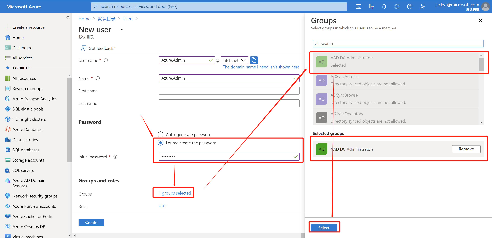
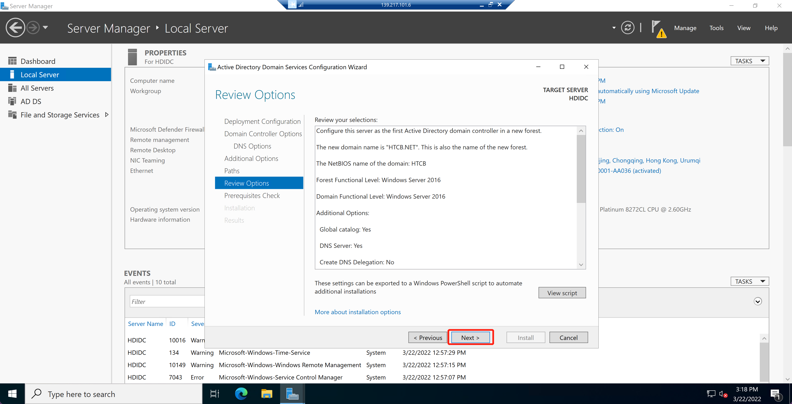
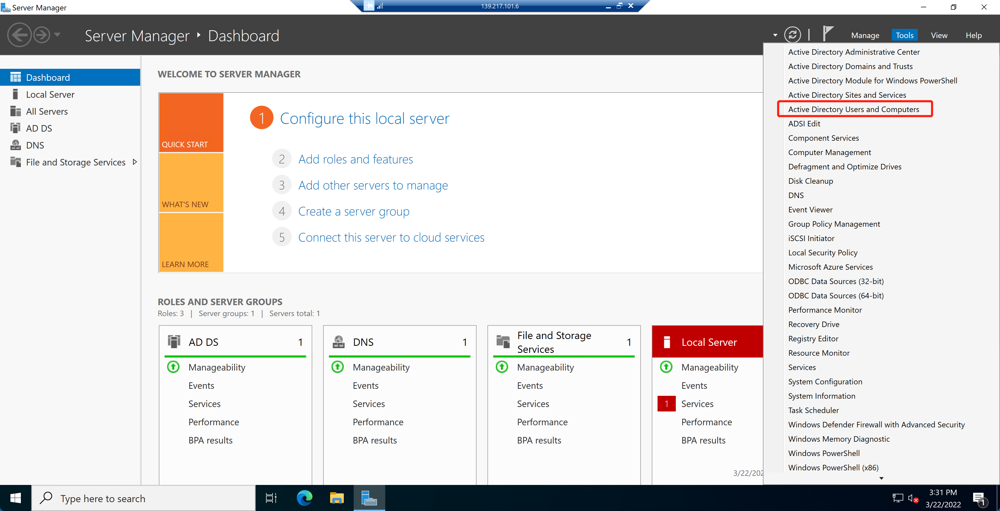
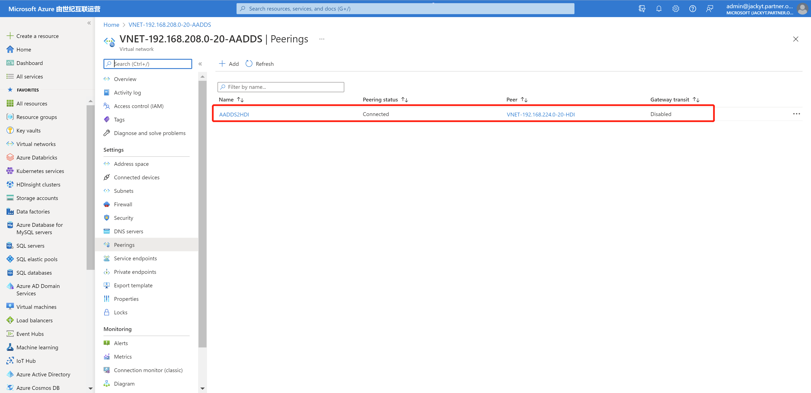

# ESP-Based HDInsight Deployment

<font size=8 color=red><B>Internal Edition - NO SHARING! </B></font>

# The Outline
- [ESP-Based HDInsight Deployment](#esp-based-hdinsight-deployment)
- [The Outline](#the-outline)
  - [Deployment Architecture](#deployment-architecture)
  - [Azure Visual Network](#azure-visual-network)
  - [Azure Actively Directory](#azure-actively-directory)
    - [Create a Custom Domain](#create-a-custom-domain)
    - [(Option) Create a Azure AD Admnistrators User](#option-create-a-azure-ad-admnistrators-user)
  - [(Option) AD User/Group sync to AAD](#option-ad-usergroup-sync-to-aad)
    - [AD/DS Deployment](#adds-deployment)
    - [AD/DS Configure](#adds-configure)
    - [Azure AD Connect Deployment](#azure-ad-connect-deployment)
    - [Azure AD Connect Configure](#azure-ad-connect-configure)
  - [Azure Actively Directory Domain Services](#azure-actively-directory-domain-services)
    - [Azure Actively Directory Domain Services Deployment](#azure-actively-directory-domain-services-deployment)
    - [Azure Actively Directory Domain Services Configure](#azure-actively-directory-domain-services-configure)
  - [Azure Storage](#azure-storage)
  - [Azure Managed Identity](#azure-managed-identity)
    - [Azure Managed Identity Department](#azure-managed-identity-department)
    - [Assign HDInsight Contributor Role to Managed Identity at AADDS](#assign-hdinsight-contributor-role-to-managed-identity-at-aadds)
    - [Assign Storage Owner Role to Managed Identity at Storage Account](#assign-storage-owner-role-to-managed-identity-at-storage-account)
  - [Azure Database for SQL Database](#azure-database-for-sql-database)
  - [ESP with HDInsight Clusters](#esp-with-hdinsight-clusters)
    - [HDInsight Deployment](#hdinsight-deployment)
    - [HDInsight Configure](#hdinsight-configure)
    - [HDInsight Manage](#hdinsight-manage)
  - [Important Tips:](#important-tips)
    - [Deploy ESP w/ HDInsight Cluster](#deploy-esp-w-hdinsight-cluster)

## Deployment Architecture


## Azure Visual Network

  | ID  | Visual Network Name         | Subnet Name                       | IP Pool          | IP CRUD          | Remark                    |
  | --- | --------------------------- | --------------------------------- | ---------------- | ---------------- | ------------------------- |
  | 1   | VNET-192.168.192.0-20-AD    |                                   | 192.168.192.0/20 |                  |                           |
  | 1.1 |                             | default-192.168.192.0-24          |                  | 192.168.192.0/24 | Reserved                  |
  | 1.2 |                             | subnet-vm-192.168.193.0-24        |                  | 192.168.193.0/24 | Deploy AD Server          |
  | 2   | VNET-192.168.208.0-20-AADDS |                                   | 192.168.208.0/20 |                  |                           |
  | 2.1 |                             | default-192.168.208.0-24          |                  | 192.168.208.0/24 | Reserved                  |
  | 2.2 |                             | subnet-aadds-192.168.209.0-24     |                  | 192.168.209.0/24 | Deploy Azure AD DS        |
  | 2.3 |                             | subnet-vm-192.168.210.0-24        |                  | 192.168.210.0/24 | Deploy Azure AD DS Client |
  | 3   | VNET-192.168.224.0-20-HDI   |                                   | 192.168.224.0/20 |                  |                           |
  | 3.1 |                             | default-192.168.224.0-24          |                  | 192.168.224.0/24 | Reserved                  |
  | 3.2 |                             | subnet-databases-192.168.225.0-24 |                  | 192.168.225.0/24 | Deploy Metadata SQL DBs   |
  | 3.3 |                             | subnet-hdi-192.168.226.0-24       |                  | 192.168.226.0/24 | Deploy HDInsight Clusters |

## Azure Actively Directory
### Create a Custom Domain
* Example: HTCB.NET
  > Buy Domian Name: <https://domains.google.com/>
* Create and Verify Custom Domain
  
  
  
### (Option) Create a Azure AD Admnistrators User
* Example: Azure.Admin@htcb.net
> For Sync AD User/Group to Azure AD

  
  
  
  
  * Use Azure.Admin@htcb.net login [Azure Portal](https://portal.azure.com) first time need to change password, let the account available in other place.
    * If Azure China Cloud, DO NOT ues custom domian's account to login in Azure AD Connect tool, will be use have Global Administator privilege Azure AD account, like: xxx@yyy.partner.onmschina.cn
  * Tips: Appendix: How to fully remove Azure AD Connect

## (Option) AD User/Group sync to AAD
### AD/DS Deployment
* Deploy Windows Server 2022
  * Network Configure
    * Disable IP v6
    * Configure IP v4
      * IP Address
      * Mask
      * Gateway
      * DNS: Add 127.0.0.1
* Disable IE Enhanced Security Configuration
* Change Time-Zone to UTC +8:00
* System Update
  
### AD/DS Configure
* Install domain serives
* Install telnet client
* Install .NET 3.5
  
  
  
  
  
  
* Configure New DC
  
  
  
  
  
  
  
  
  
* Create OU/ Group and Users
  
  
  
  
  
  
  
  
  
  
### Azure AD Connect Deployment
  [Download Azure AD Connect and Install](https://www.microsoft.com/en-us/download/details.aspx?id=47594)
  
### Azure AD Connect Configure
  
  
  
  
  
  
  
  

## Azure Actively Directory Domain Services
> - The domain name that you use with Azure AD DS must be 39 characters or fewer, to work with HDInsight.
> - Example: **HTTP/hn0-e0f157.htcb.net@HTCB.NET** (Deployment in the background, automatically creating accounts)
> - [Configure HDInsight clusters for Azure Active Directory integration with Enterprise Security Package](https://docs.microsoft.com/en-us/azure/hdinsight/domain-joined/apache-domain-joined-configure-using-azure-adds)

### Azure Actively Directory Domain Services Deployment
  
  
  
  
  
  
  
  
  
  

### Azure Actively Directory Domain Services Configure  
* DNS Configure
  
  
  
  
  
  
* AADDS Secure LDAP Configure
   
  ```powershell
  # Create an new Certificate
  $lifetime = Get-Date
  New-SelfSignedCertificate -Subject htcb.net `
  -NotAfter $lifetime.AddDays(365) -KeyUsage DigitalSignature, KeyEncipherment `
  -Type SSLServerAuthentication -DnsName *.htcb.net, htcb.net
  ```
   
   
   
   
   
   
   
   
   
   
   
* NSG Inbound Configure (Example: Global Azure - West US)
   
  | ID  | Name                  | Port                        | Protocol | Source           | Destination | Type        |
  | --- | --------------------- | --------------------------- | -------- | ---------------- | ----------- | ----------- |
  | 1   | Port_LDAP_636         | 636                         | Any      | 192.168.224.0/20 | Any         | LDAP        |
  | 2   | Port_HDITagGloabl_443 | 443                         | Any      | HDInsight        | Any         | Service Tag |
  | 3   | Port_HDITagWUS_443    | 443                         | Any      | HDInsight.WestUS | Any         | Service Tag |
  | 4   | Port_168.63.129.16    | 53                          | Any      | 168.63.129.16    | Any         | Route       |
  | 5   | Port_168.61.49.99     | 443                         | Any      | 168.61.49.99     | Any         | HDI         |
  | 6   | Port_23.99.5.239      | 443                         | Any      | 23.99.5.239      | Any         | HDI         |
  | 7   | Port_168.61.48.131    | 443                         | Any      | 168.61.48.131    | Any         | HDI         |
  | 8   | Port_138.91.141.162   | 443                         | Any      | 138.91.141.162   | Any         | HDI         |
  | 9   | Port_40.73.37.141     | 443                         | Any      | 40.73.37.141     | Any         | MCNorth-HDI |
  | 10  | Port_40.73.38.172     | 443                         | Any      | 40.73.38.172     | Any         | MCNorth-HDI |
  | 11  | Port_Kerberos         | 389,636,3268,3269,88,53,135 | Any      | 192.168.224.0/20 | Any         | Kerberos    |

   
* Refer:<br/>
  [Tutorial: Configure secure LDAP for an Azure Active Directory Domain Services managed domain](https://docs.microsoft.com/en-us/azure/active-directory-domain-services/tutorial-configure-ldaps)<br/>
  [NSG service tags for Azure HDInsight](https://docs.microsoft.com/en-us/azure/hdinsight/hdinsight-service-tags)<br/>
  [HDInsight management IP addresses](https://docs.microsoft.com/en-us/azure/hdinsight/hdinsight-management-ip-addresses)
* Refresh AADDS Users Password by scripts in AD/DS VM
  ```powershell
  # Define the Azure AD Connect connector names and import the required PowerShell module
  $azureadConnector = "jackyt.partner.onmschina.cn - AAD"
  $adConnector = "HTCB.NET"
  
  Import-Module "C:\Program Files\Microsoft Azure AD Sync\Bin\ADSync\ADSync.psd1"
  Import-Module "C:\Program Files\Microsoft Azure Active Directory Connect\AdSyncConfig\AdSyncConfig.psm1"
  
  # Create a new ForceFullPasswordSync configuration parameter object then
  # update the existing connector with this new configuration
  $c = Get-ADSyncConnector -Name $adConnector
  $p = New-Object Microsoft.IdentityManagement.PowerShell.ObjectModel.ConfigurationParameter "Microsoft.Synchronize.ForceFullPasswordSync", String, ConnectorGlobal, $null, $null, $null
  $p.Value = 1
  $c.GlobalParameters.Remove($p.Name)
  $c.GlobalParameters.Add($p)
  $c = Add-ADSyncConnector -Connector $c
  
  # Disable and re-enable Azure AD Connect to force a full password synchronization
  Set-ADSyncAADPasswordSyncConfiguration -SourceConnector $adConnector -TargetConnector $azureadConnector -Enable $false
  Set-ADSyncAADPasswordSyncConfiguration -SourceConnector $adConnector -TargetConnector $azureadConnector -Enable $true
  ```
   
   
   
* Peering Between HDI's VNET and AADDS's VNET
  
  
  
  
* Join outside Windows Server to Manage AADDS
   
   
   
   
   
   
   
   
   
   
  
* Join outside CentOS client to AADDS
  ```bash
  sudo yum upgrade
  sudo yum update
  
  sudo vi /etc/hosts
  127.0.0.1 hdicent002.honor.net hdicent002
  
  sudo yum install adcli realmd sssd krb5-workstation krb5-libs oddjob oddjob-mkhomedir samba-common-tools -y
  
  sudo realm discover HONOR.NET
  
  kinit HDIAdmin@HONOR.NET
  [Guid("9658C6F3-624B-4BC4-84F2-324234A8E8D6")]
  
  vi /etc/krb5.conf
  # Add line
  rdns=false
  
  sudo realm join --verbose HONOR.NET -U 'HDIAdmin@HONOR.NET' --membership-software=adcli
  
  sudo vi /etc/ssh/sshd_config
  PasswordAuthentication yes
  sudo systemctl restart sshd
  
  sudo visudo
  # Add 'AAD DC Administrators' group members as admins.
  %AAD\ DC\ Administrators@HONOR.NET ALL=(ALL) NOPASSWD:ALL
  
  ssh -l HDIAdmin@HONOR.NET hdicent002.honor.net
  pwd
  id
  
  sudo yum update
  ```
  
## Azure Storage
| ID  | Storage Name       | Storage SKU                    | Remark       |
| --- | ------------------ | ------------------------------ | ------------ |
| 1   | adls4hdi001        | StorageV2 (general purpose v2) | Except HBase |
| 2   | premiumblob4hdi001 | BlockBlobStorage               | For HBase    |


## Azure Managed Identity
### Azure Managed Identity Department

### Assign HDInsight Contributor Role to Managed Identity at AADDS


### Assign Storage Owner Role to Managed Identity at Storage Account


## Azure Database for SQL Database
| ID  | Azure SQL Servers | Elastic Pool   | Database Name  | Remark    |
| --- | ----------------- | -------------- | -------------- | --------- |
| 1   | sqldb4daas4hdi    | SQLElasticPool | AmbariDB4Spark | Exclusive |
| 2   | sqldb4daas4hdi    | SQLElasticPool | AmbariDB4Kafka | Exclusive |
| 3   | sqldb4daas4hdi    | SQLElasticPool | AmbariDB4Hive  | Exclusive |
| 4   | sqldb4daas4hdi    | SQLElasticPool | AmbariDB4HBase | Exclusive |
| 5   | sqldb4daas4hdi    | SQLElasticPool | HiveDB         | Shareable |
| 6   | sqldb4daas4hdi    | SQLElasticPool | OozieDB        | Shareable |
| 7   | sqldb4daas4hdi    | SQLElasticPool | RangerDB       | Shareable |


## ESP with HDInsight Clusters
| ID  | HDInsight Name     | Template          | Remark |
| --- | ------------------ | ----------------- | ------ |
| 1   | E0F157BE-HDI-Spark | Spark             |        |
| 2   | F0F157BE-HDI-HBase | HBase             |        |
| 3   | G0F157BE-HDI-Hive  | Interactive Query |        |
| 4   | H0F157BE-HDI-Kafka | Kafka             |        |
> The cluster name first 6 characters must be unique<br/>
> Others Learn:<br/>
> * In the template package created by HDInsight, some components may contain each other, but the official guidelines should be strictly followed. Only the components recommended by the template package should be mainly used, and other subordinate components are only used for auxiliary roles.<br/>
> * In the actual development and task submission process, based on security and misoperation protection considerations, it is usually not allowed to log in to the Head Nodes directly through the SSH client. Most users will consider deploying additional virtual machines for remote client configuration for remote task submission and script execution. In this regard, it is strongly recommended to use Edge Nodes, and it is not recommended to configure external virtual machines and component clients for link access.
### HDInsight Deployment


    
### HDInsight Configure
* Disable ACID with Hive Table - Amberi Portal - Hive Conf
  | ID  | Paramter                      | Vaule                                             |
  | --- | ----------------------------- | ------------------------------------------------- |
  | 1   | hive.strict.managed.tables    | false                                             |
  | 2   | hive.support.concurrency      | false                                             |
  | 3   | hive.txn.manager              | org.apache.hadoop.hive.ql.lockmgr.DummyTxnManager |
  | 4   | hive.enforce.bucketing        | false                                             |
  | 5   | hive.compactor.initiator.on   | false                                             |
  | 6   | hive.compactor.worker.threads | 0                                                 |
  | 7   | hive.create.as.insert.only    | false                                             |
  | 8   | metastore.create.as.acid      | false                                             |
* Why NEED disable ACID in Hive Table<br/>
  * For Microsoft Production Support:<br/>
    * [Use external Hive Metastore for Synapse Spark Pool](https://docs.microsoft.com/en-us/azure/synapse-analytics/spark/apache-spark-external-metastore#known-limitations)<br/>
      * Currently Spark only works on external Hive tables and non-transactional/non-ACID managed Hive tables. It doesn't support Hive ACID/transactional tables.
      * As mentioned in the limitations, Synapse Spark pool only supports external hive tables and non-transactional/ACID managed tables, it doesn't support Hive ACID/transactional tables currently. In HDInsight 4.0 Hive clusters, all managed tables are created as ACID/transactional tables by default, that's why you get empty results when querying those tables.
    * Synapse Pipeline
    * Synapse External Table
    * Synapse Serverless Pool
    * Databricks
    * Data Factory<br/>
    > All of Spark-Based Service DO NOT SUPPORT ACID HIVE TABLE even READ HIVE TABLE'S RAW DATA FILE (TESTED)

  * For Customer Feedback:
    Using Hive ACID to ensure transaction consistency will lead to a large number of lock waits or deadlocks. The current mainstream practice in the industry is to use Apache Hudi to provide transaction consistency guarantee(The current version of HDInsight does not provide Hudi, and manual deployment of Hudi will be more intrusive to HDInsight)
* Allow access both of Spark and Hive tables metadata - In Spark Cluster
  | ID  | Paramter                  | Set Vaule | Default Vaule |
  | --- | ------------------------- | --------- | ------------- |
  | 1   | metastore.catalog.default | hive      | spark         |
  > Spark CAN access Hive External Table, CAN NOT access Hive Managed Table, If want access, need create spark external table, let hive managed table as external table, via HWC to access
* Same cluster Spark access Hive's jars<br/>
  * Option 1: 
    Add jar to hive_aux_jars (goto Ambari--> hive --> config --> hive-env template)
    ```bash
    export HIVE_AUX_JARS_PATH=$HIVE_AUX_JARS_PATH:<sample1.jar>:<sample2.jar>
    ```
  * Option 2:
    Add the jar to Auxillary JAR list (goto Ambari--> hive --> config --> Auxillary JAR list)
    ```ini
    Auxillary JAR list=<sample1.jar>: <sample2.jar>
    ```
* Beeline SET --hiveconf
  | ID  | Parameter                                               | New Vaule     |
  | --- | ------------------------------------------------------- | ------------- |
  | 1   | hive.security.authorization.sqlstd.confwhitelist.append | xxx\|yyy\|zzz |

  Example:
  ```bash
  beeline -u 'jdbc:hive2://zk0-e0f157.honor.net:2181,zk1-e0f157.honor.net:2181,zk3-e0f157.honor.net:2181/;serviceDiscoveryMode=zooKeeper;zooKeeperNamespace=hiveserver2' -f SQLQuery.sql --hiveconf xxx=??? --hiveconf yyy=??? --hiveconf zzz=???
  
  beeline -u 'jdbc:hive2://zk0-e0f157.honor.net:2181,zk1-e0f157.honor.net:2181,zk3-e0f157.honor.net:2181/;serviceDiscoveryMode=zooKeeper;zooKeeperNamespace=hiveserver2'
  beeline > SET xxx=???;
  ```
  > --hivevar NOT NEED Configuration
* Create users Kerberos Keytab file by customer
  ```bash
  ktutil
  ktutil: addent -password -p HDIAdmin@HONOR.NET -k 1 -e RC4-HMAC
  Password for HDIAdmin@HONOR.NET: [Guid("9658C6F3-624B-4BC4-84F2-324234A8E8D6")]
  ktutil: wkt HDIAdmin.keytab
  ktutil: read_kt HDIAdmin.keytab
  ktutil: list
  ktutil: q
  ```
  Use keytab, Example:
  ```bash
  vi demo.sh
  ------
  # Read keytab information
  kinit -kt /home/sshuser/HDIAdmin.keytab HDIAdmin@HONOR.NET
  
  # spark-sql
  spark-sql -f SQLQuery.sql
  # hive/beeline - zookeeper
  beeline -u 'jdbc:hive2://zk0-e0f157.honor.net:2181,zk1-e0f157.honor.net:2181,zk3-e0f157.honor.net:2181/;serviceDiscoveryMode=zooKeeper;zooKeeperNamespace=hiveserver2' -f SQLQuery.sql
  # hive/beeline - headnode
  beeline -u 'jdbc:hive2://hn0-e0f157.honor.net:10001/default;principal=hive/_HOST@HONOR.NET;auth-kerberos;transportMode=http' -n HDIAdmin@HONOR.NET -f SQLQuery.sql
  # Sqoop - wasbs cache
  cp /usr/hdp/4.1.8.19/hadoop-mapreduce/hadoop-mapreduce-* /usr/hdp/4.1.8.19/sqoop/lib/
  cp /home/HONOR.NET/hdiadmin/mysql-connector-java-5.1.49* /usr/hdp/4.1.8.19/sqoop/lib/
  sqoop import -D mapred.job.queue.name=testq1 \
  --connect 'jdbc:mysql://mysql4sqoop.mysql.database.azure.com:3306/information_schema?serverTimezone=Asia/Shanghai' --username insadmin@mysql4sqoop --password '6F914D1F@5316@4683@baee@E6CAFA4A6A92' \
  --query "SELECT CHARACTER_SET_NAME,DEFAULT_COLLATE_NAME,DESCRIPTION,MAXLEN FROM CHARACTER_SETS where 1=1 and \$CONDITIONS" \
  --target-dir 'wasbs://caches@blob4honor.blob.core.chinacloudapi.cn/character_sets_import003' \
  --fields-terminated-by '\t' \
  --lines-terminated-by '\n' \
  --create-hive-table \
  --hive-database 'DEMO' \
  --hive-table 'character_sets_import008' \
  --hive-import -m 2 --split-by MAXLEN
  # Sqoop - hdfs cache
  sqoop import -D mapred.job.queue.name=testq1 \
  --connect 'jdbc:mysql://mysql4sqoop.mysql.database.azure.com:3306/information_schema?serverTimezone=Asia/Shanghai' --username insadmin@mysql4sqoop --password '6F914D1F@5316@4683@baee@E6CAFA4A6A92' \
  --query "SELECT CHARACTER_SET_NAME,DEFAULT_COLLATE_NAME,DESCRIPTION,MAXLEN FROM CHARACTER_SETS where 1=1 and \$CONDITIONS" \
  --target-dir 'character_sets_import' \
  --fields-terminated-by '\t' \
  --lines-terminated-by '\n' \
  --create-hive-table \
  --hive-database 'DEMO' \
  --hive-table 'character_sets_import003' \
  --hive-import -m 2 --split-by MAXLEN
  
  # Destroy keytab information
  kdestroy
  
  ------
  chmod u+x demo.sh
  ./demo.sh
  ```
### HDInsight Manage
* Ambari Portal
  
  
* Ranger Portal
  
  
  
  
## Important Tips:
### Deploy ESP w/ HDInsight Cluster
  * [Azure HDInsight supported node configurations | Microsoft Docs](https://docs.microsoft.com/en-us/azure/hdinsight/hdinsight-supported-node-configuration)
    